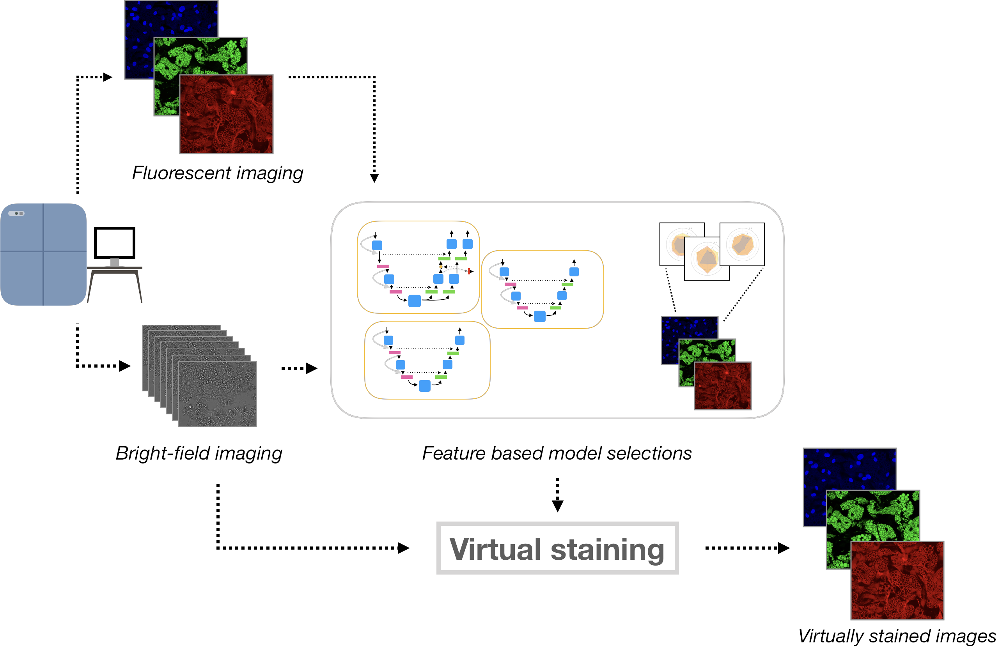

# Biologically RElevant VIrtual Staining

In this repository we provide the code base that accompanies the paper:

## Learning to see colours: generating biologically relevant fluorescent labels from bright-field images

#### by Håkan Wieslander, Ankit Gupta, Ebba Bergman, Erik Hallström and Philip J Harrison

<p>
    
    <center>Proposed reconstruction methodology for fluorescent images. (A) Cell cultures imaged with bright-field microscopy. (B) Each fluorescent channel was reconstructed with a specialized neural network. The nuclei reconstruction model employed Learning Using Privileged Information (LUPI), where cell segmentation masks were utilized as privileged information. Lipid reconstruction made use of an adversarial training scheme and the cytoplasm reconstruction was based solely on the image reconstruction loss. (C) Reconstructed fluorescent images from bright-field.</center>
</p>

<p>
    
    <center>Comparison of images generated from the bright-field z-stack and the ground truth fluorescence images. (A-C) Generated images for the nuclei, lipid droplets and cytoplasm, with zoomed in regions showing some well reconstructed areas alongside some more problematic locations. (D-F) Ground truth images with corresponding zoomed in regions. (G) Maximum projection of the bright-field z-stack with corresponding zoomed in regions.</center>
</p>

The content and structure of the repo is given by the following: 

```sh
.
├── README.md
├── ai_haste
│   ├── data                : python scripts for loading the datasets required
│   ├── loss                : for loss functions not included in PyTorch
│   ├── model               : python scripts for the various neural networks
│   ├── tester              : scripts requied when running the models in test mode
│   ├── trainer             : scripts requied when running the models in train mode
│   └── utils               : utility functions (e.g. for converting the images to numpy arrays for faster data loading)
├── config
│   ├── train               : .json files for running the models to reconstruct the three fluorescence channels
│   │   ├── C1              : nuclei          
│   │   ├── C2              : lipids
│   │   └── C3              : cytoplasm
│   └── test                : .json files for running the models in test mode for the three resolutions
│                              (across all three fluorescence channels)
├── docker                  : files for Docker image construction and running
└── exp_stats               : .csv files for image statistics and train/test splits 
    
```
## Docker image
On AZ server:

### 1. Build the docker image if it doesn't exist
`docker build -t 3h4m/haste .`

### 2. Run training with docker
`./run_with_docker.sh -c config.json`

### 3. Run the shell with docker
`docker run --shm-size=24gb -it --rm -v /home/group5/:/workspace 3h4m/haste bash`

---

### Install docker
`curl -sSL https://get.docker.com/ | sh`

### Pull the image 
`sudo docker pull 3h4m/haste`

### Connect to the kernel
`sudo docker run -it 3h4m/haste bash`

---

## Running inference

To run the inference you run ai_haste as a module while specifying which config file to use. All configs for inference are located in the "config/test" folder for the different magnifications. The module will run inference on all models (1 model per channel) at the same time and write the result in a pre-specified output folder.

To begin, download the models and put them in the "models" folder. Then edit each config file in "configs/test" and specify the data path and the output path.
```
config
│── "exp_folder":  <--- Path to output folder goes here            
│   │
│   │
│── "data"             
│   ├── "folder":"" <--- Path to data folder goes here
```

Inference is then executed by:
```
python3 -m ai_haste -c configs/test/test_20x.json 
python3 -m ai_haste -c configs/test/test_40x.json 
python3 -m ai_haste -c configs/test/test_60x.json 
```
## Training
Training can be performed by changing selecting the data folders and magnifications and changing "run_mode" to "train" in the config and executed by

```
python3 -m ai_haste -c configs/train/C1/C1_20x.json 
python3 -m ai_haste -c configs/train/C2/C2_20x_pretrain.json 
python3 -m ai_haste -c configs/train/C1/C3_20x_pretrain.json 
```
